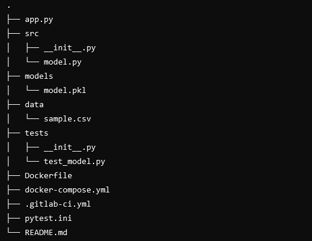

### ITI UFSCar - MBA Machine Learning In Production
# Engenharia de Machine Learning Módulo 2 - Atividade 1

##  Projeto de Previsão de Preços com Streamlit

Este projeto utiliza um modelo de machine learning para prever preços com base em dados históricos. A aplicação foi desenvolvida com Streamlit para criar uma interface interativa e é integrada com um processo de Continuous Integration (CI) usando GitLab CI.

### Estrutura do Projeto

O projeto está organizado da seguinte forma:



## Configuração do CI no GitLab

O pipeline de CI é configurado através do arquivo `.gitlab-ci.yml`. Ele define três etapas principais:

### Lint

- **Objetivo**: Verificar a conformidade do código com o padrão de estilo.
- **Comandos**:

    ```bash
    # O lint foi removido, então não há comandos para esta etapa.
    ```

### Test

- **Objetivo**: Executar testes automatizados para garantir que o código esteja funcionando conforme o esperado.
- **Comandos**:

    ```bash
    export PYTHONPATH=.
    pytest ./tests
    ```

### Build and Push

- **Objetivo**: Construir a imagem Docker da aplicação e enviá-la para o Docker Hub.
- **Comandos**:

    ```bash
    docker build -t <username>/streamlit-app:latest .
    docker push <username>/streamlit-app:latest
    ```

## Docker

### Construir e Executar o Contêiner

Para construir e executar a aplicação em um contêiner Docker:

```bash
docker-compose up --build
```